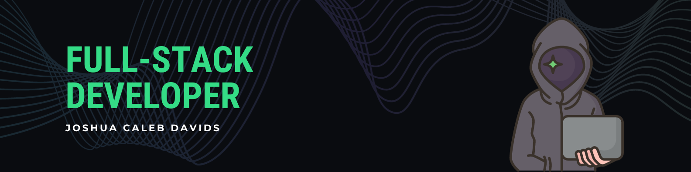

# 👋🏽 Hi there, I'm Joshua - aka Caleb

## 🧑🏽 I'm a Student and Developer!

- 🔭 I'm currently building [NanoCore, a basic Operating System](https://github.com/JoshuaDavids/Personal.Nano-Core-OS)!
- 🌱 I'm currently learning C, C++ and C#
- 💻 I'm looking to build more complicated projects
- 🥅 2024 Goals: Code some more personal projects
- ⚡ Fun Fact: I enjoy late night drives, rugby and spending time with the homies

### 🎧 Now Playing on Spotify:

### 🔗 Connect with Me:

&nbsp;&nbsp;

### 🧑🏽‍💻 Languages and Tools:

 

---

  
:zap: GitHub Stats

   
  

